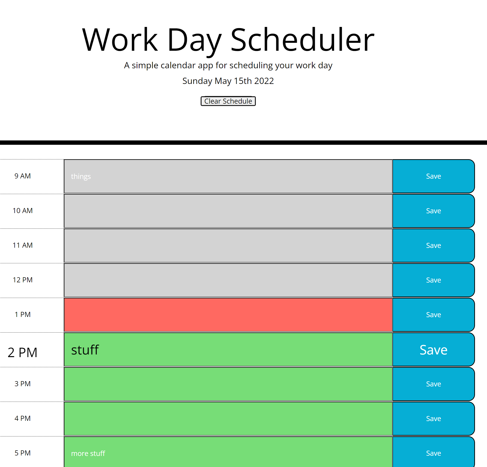
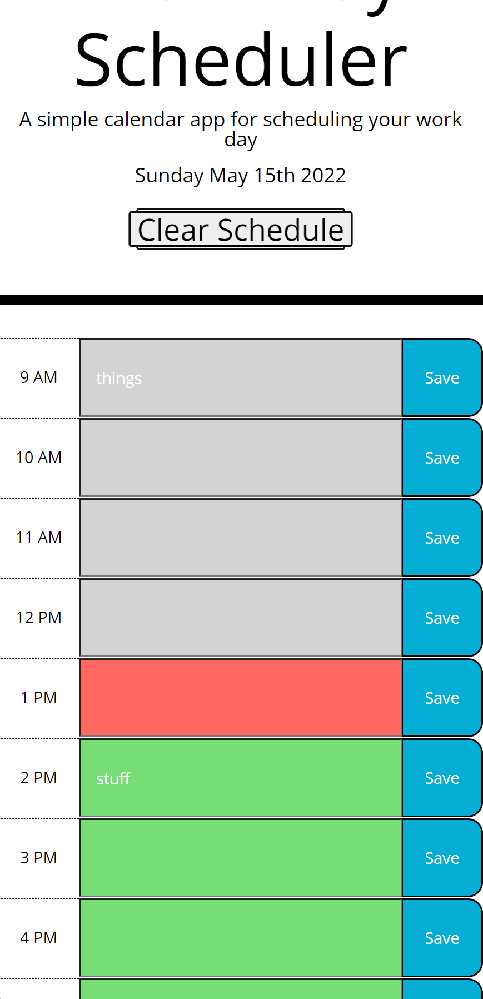
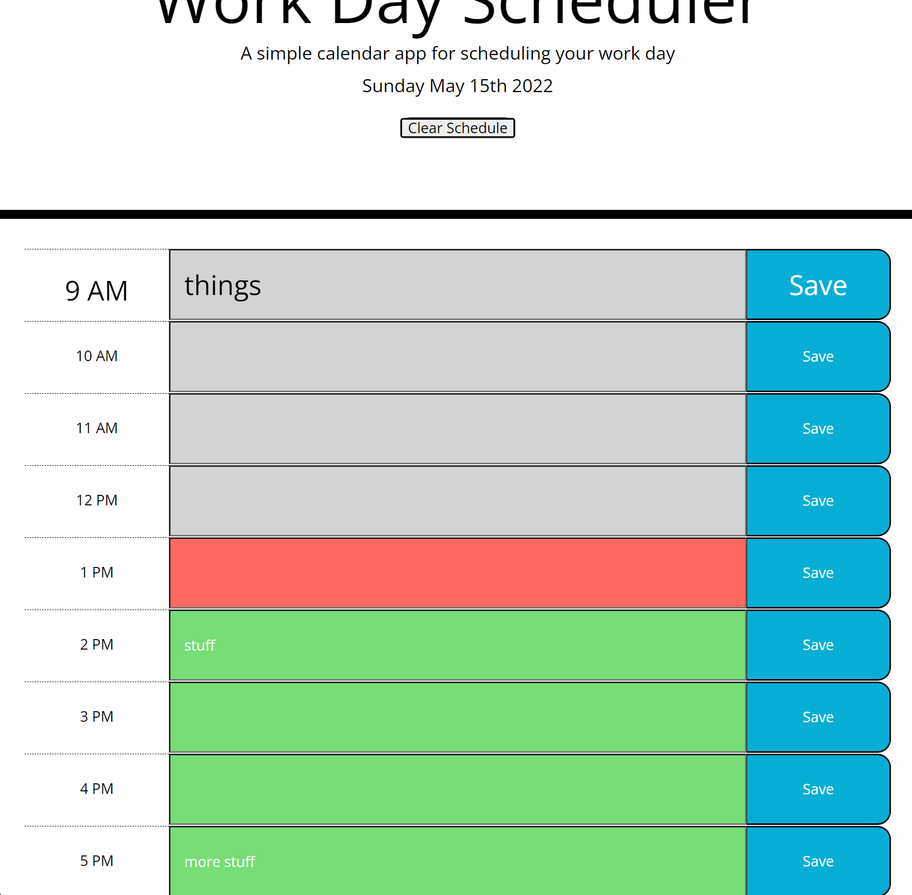

# Work-Day-Scheduler

Work Day Scheduler Website [https://quicksilver524.github.io/Work-Day-Scheduler/]

Github repo source [https://github.com/quicksilver524/Work-Day-Scheduler]

                                      Description:
           Hello, This is my work day scheduler app. The goal was to develop a 
           scheduling app that would locally save you schedule as you change it, 
           let you know based on color when an item was late (gray), present (red), 
           or future (green). I made a few additional changes to cause the clear 
           button to enlarge along with the save button. I did this to improve 
           functional use with save and your input with it additionally changing 
           color to let you know which your hovering over to help with clicking the 
           right section. I finally made the row enlarge to help with reading and 
           reduce errors with use. 

  # Work-Day-Scheduler Webpage:  
  
  # Scalable and interactive buttons Webpage:  
 
  # Interactive buttons in the schedule and save button Webpage:  
